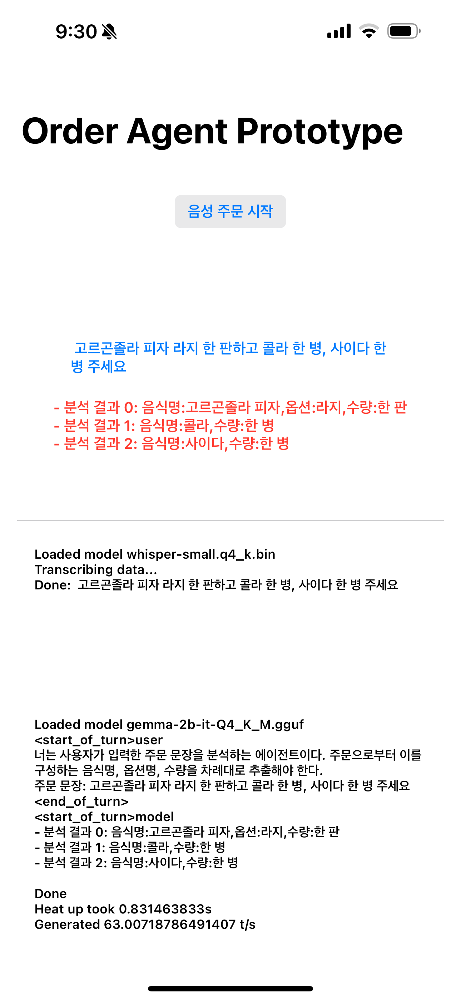

# 음식 주문 자동화를 위한 온디바이스 생성형 언어 모델 개발

# 개요

'음식 주문 자동화를 위한 온디바이스 생성형 언어 모델 개발' 연구

연구 내용
- 서빙 로봇 등을 통한 음성 주문으로부터 음식명/옵션/수량을 분석하는 주문 이해 시스템 개발
  - 음성 주문: '여기요, 페퍼로니 피자 미디엄 사이즈 1개랑 복숭아티 1잔 주세요.'
  - 주문 이해: '음식명: 페퍼로니 피자, 옵션: 미디엄, 수량: 1개, 음식명: 복숭아티, 수량: 1잔'
- 도메인 데이터셋 생성
  - GPT-4 모델을 미세 튜닝하여 음식 주문 도메인 데이터 예제 데이터 30,000 여개 생성
- 미세 튜닝
  - Hugging Face transformers, PEFT를 활용하여 오픈소스 언어 모델 미세 튜닝
- 온디바이스 프로토타입
  - Swift UI를 이용하여 IOS 앱 개발

## 프로토타입 앱

화면 소개
- (아이폰 14 프로 이상 구동)
- 음성으로 주문을 발화하면 음성 인식 수행 (`whisper-small` 모델)하여 주문 문장화: 파란색 글씨로 표시
- 주문 문장을 주문 이해 수행 (`gemma-2b-it` 미세 튜닝 모델)하여 음식/옵션/수량으로 분석: 빨간색 글씨로 표시




# 도메인 데이터셋 생성
[OpenAI ChatCompletion API 호출용 프롬프트 템플릿](train_and_eval/prompt/prompt-template.txt)
- 템플릿 파일에서 `{0}` 부분은 실제 음식명 중에서 무작위로 40개를 샘플링하여 콤마로 구분하여 대체함
- API를 통해 `gpt-4` 모델을 활용하여 30,000 여개의 주문-분석 예제 데이터셋을 생성

전체 데이터셋의 일부인 [3,000 여개의 샘플 데이터셋](train_and_eval/data/food-order-understanding-sample-3k.json)을 공개 (참고: 전체 데이터셋의 완전 공개는 리포지터리 소유자와 개별 협의하여 확인할 수 있음)
- 예시
    ```json
    {
    ...
    'input': '다음은 매장에서 고객이 음식을 주문하는 주문 문장이다. 이를 분석하여 음식명, 옵션명, 수량을 추출하여 고객의 의도를 이해하고자 한다.\n분석 결과를 완성해주기 바란다.\n\n### 명령: 페퍼로니피자 미디엄 사이즈 1개랑 복숭아 티 1잔 주세요. ### 응답:\n',
    'output': '- 분석 결과 0: 음식명:페퍼로니피자,옵션:미디엄,수량:1개\n- 분석 결과 1: 음식명:복숭아 티,수량:1잔'
    ...
    }
    ```

# 학습 및 검증

## 준비

실험 장비
- I9-13900K, 64GB RAM, RTX 4090

패키지 설치

```bash
pip install -r requirements.txt
```

## 미세 튜닝

예시
- [3,000 여개의 샘플 데이터셋](train_and_eval/data/food-order-understanding-sample-3k.json) 에 대해서
- `google/gemma-2b-it` 모델을 미세 튜닝

```bash
cd train-and-eval
python source/sft_general-food_order_understanding.py ./run-train-args.json
```

## 검증

예시
- 미세 튜닝된 모델을 테스트셋에 대해 BLEU 점수를 측정
- (학습과 검증시 동일 랜덤시드로 훈련셋/테스트셋 분리)

```bash
python source/eval_general-food_order_understanding.py ./run-eval-args.json
```

# 온디바이스 프로토타입 앱

[Swift UI Xcode 프로젝트](order-agent-prototype.xcodeproj)
- 아이폰 14 프로에서 구동 확인

## 빌드 필요 조건

- 음성 인식 모델 통합: [whisper.cpp](https://github.com/ggerganov/whisper.cpp)
  - OpenAI의 [whisper](https://huggingface.co/collections/openai/whisper-release-6501bba2cf999715fd953013) 모델을 C++ 포팅
  - `whisper` 모델의 양자화 수행에 필요
  - `./order-agent-prototype/Resources/models/` 에 양자화된 모델 추가해야 함 (예: `whisper-small.q4_k.bin`)
- 생성형 언어 모델 통합: [llama.cpp](https://github.com/ggerganov/llama.cpp)
  - 디코더 기반 트랜스포머 모델을 C++ 포팅
  - 미세 튜닝된 모델의 양자화 수행에 필요
  - `./order-agent-prototype/Resources/models/` 에 양자화된 모델 추가해야 함 (예: `gemma-2b-it-Q4_K_M.gguf`)
- [스위프트 패키지: whisper-llama-lib](https://github.com/jangmino/whisper-llama-lib)
  - whisper.cpp 와 llama.cpp의 핵심 모듈을 스위프트 패키지로 래핑
  - 음성 인식 과정과 분석 결과 생성을 위해 필요

